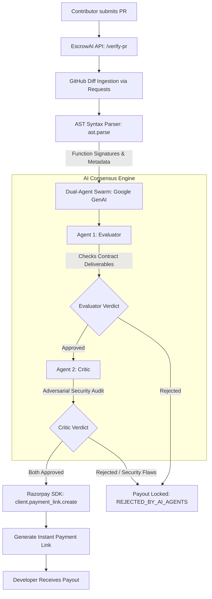

# 🤖 EscrowAI

### *Autonomous, AI-Audited Escrow & Milestone Verification Engine*

[](https://python.org)
[](https://fastapi.tiangolo.com)
[](https://aistudio.google.com)
[](https://razorpay.com)
[](https://tailwindcss.com)
[](LICENSE)

---

## 🎯 Executive Summary (Razorpay AI Buildathon)

**EscrowAI** replaces traditional, friction-heavy freelance escrow arbitration and brittle webhook automation with a **self-governing, multi-agent AI verification swarm**. 

By pairing **Abstract Syntax Tree (AST) code extraction** with an **adversarial dual-agent review cycle (Evaluator + Critic)** powered by **Gemini 3.6 Flash**, EscrowAI verifies pull requests against milestone acceptance criteria. Once consensus is reached, it automatically triggers instant milestone disbursement using **Razorpay's Payment Links API**.

---

## 🚨 The Problem

1. **The Milestone Review Bottleneck**:
   In freelance platforms (Upwork, Fiverr) and open-source bounty boards (Gitcoin), releasing escrow funds depends on manual human review. Non-technical clients lack the ability to audit code quality, while developers endure payment delays ranging from days to weeks.

2. **The Naive Webhook Trap**:
   Attempts to automate milestone payouts using simple CI/CD or GitHub `pull_request.merged` webhooks create fatal vulnerabilities. Any pull request merged with non-compiling code, mock stubs, or malicious backdoors triggers unrecoverable fund releases from the escrow vault.

---

## 🏗️ System Architecture & Workflow



### 1. Ingestion & AST Code Dissection
- Pull requests are fetched directly from GitHub using `requests` (with `.diff` content negotiation).
- Rather than passing raw, unstructured git diff lines to the LLM, EscrowAI utilizes Python's native `ast` (Abstract Syntax Tree) engine to parse code hunks into validated function signatures, typed parameters, docstrings, and line numbers.

### 2. Dual-Agent Adversarial Consensus
- **Evaluator Agent (`Gemini 3.6 Flash`)**: Audits whether the code deliverables fulfill the functional acceptance criteria specified in the milestone agreement.
- **Critic Agent (`Gemini 3.6 Flash`)**: Acts as an adversarial security researcher. It audits both the code diff and the Evaluator's decision, looking for missed vulnerabilities, injection points, logic bypasses, and security flaws.
- **Consensus Gate**: Both agents must return `VERDICT: APPROVED`. If either flags an anomaly, escrow disbursement is immediately withheld.

### 3. Automated Razorpay Escrow Disbursement
- Upon consensus, EscrowAI calls the **Razorpay Payment Links API** (`client.payment_link.create`), generating a real-time, tracked payment link sent directly to the verified contributor.

---

## 🛡️ Key Security Defenses & Edge-Case Protection

EscrowAI is engineered specifically to prevent the failure modes that trick single-agent reviewers:

| Vulnerability Vector | Naive AI / Webhook Behavior | EscrowAI Critic Agent Defense |
| :--- | :--- | :--- |
| **Replay Attacks** | Passes if functions execute without crashing. | Inspects state persistence; flags missing atomic database/set deduplication on transaction IDs. |
| **Address Spoofing** | Accepts any non-empty string as a recipient address. | Enforces strict regex validation (e.g., `^0x[a-fA-F0-9]{40}$` for EVM addresses) and rejects loose truthiness checks. |
| **Boolean Type Coercion** | In Python, `isinstance(True, int)` is `True`. Insecure math checks can be tricked by boolean inputs. | Catches loose typing; enforces explicit `type(amount) is int` checks and positive integer bounds. |
| **Trivial Compliance Bypasses** | Dummy functions checking `len(pr_diff) > 0` trick basic keyword matchers. | Flags superficial validation logic that gives a false sense of security without evaluating diff content. |

---

## 💻 Tech Stack

- **Backend Framework**: [FastAPI](https://fastapi.tiangolo.com) (Python 3.12)
- **AI Engine**: [Google GenAI SDK](https://github.com/googleapis/python-genai) (`gemini-3.6-flash`)
- **Payment Infrastructure**: [Razorpay Python SDK](https://github.com/razorpay/razorpay-python) (Payment Links API)
- **Code Intelligence**: Python Native `ast` (Abstract Syntax Tree Parser)
- **Server**: [Uvicorn](https://www.uvicorn.org/) ASGI
- **Frontend Dashboard**: Tailwind CSS + Vanilla JS ([`index.html`](index.html))
- **Environment Management**: `python-dotenv`

---

## 🚀 Local Setup & Quickstart Guide

### 1. Prerequisites
- Python 3.12+ installed
- Git installed
- Razorpay Test Account ([Dashboard](https://dashboard.razorpay.com))
- Google AI Studio API Key ([Get Key](https://aistudio.google.com))

### 2. Clone the Repository
```bash
git clone https://github.com/your-username/EscrowAI.git
cd EscrowAI
```

### 3. Set Up Virtual Environment
```powershell
# Windows PowerShell
python -m venv .venv
.\.venv\Scripts\Activate.ps1

# Linux / macOS
python3 -m venv .venv
source .venv/bin/activate
```

### 4. Install Dependencies
```bash
pip install -r requirements.txt
```

### 5. Configure Environment Variables
Copy the template configuration file:
```powershell
# Windows
Copy-Item .env.example .env

# Linux / macOS
cp .env.example .env
```

Edit `.env` with your active API keys:
```dotenv
GEMINI_API_KEY=your_actual_gemini_api_key
GEMINI_MODEL=gemini-3.6-flash
RAZORPAY_KEY_ID=rzp_test_your_key_id
RAZORPAY_KEY_SECRET=your_razorpay_secret
```

### 6. Start the EscrowAI Server
```powershell
.\.venv\Scripts\python.exe main.py
```
*The server will start at `http://localhost:8000` with hot-reloading enabled.*

---

## 🖥️ Running the Interactive Demo

1. Open [`index.html`](index.html) in your browser directly, or serve it locally.
2. **Failure Mode Test (Security Rejection)**:
   - Click **Execute AI Audit & Generate Payout** with default unhardened PR.
   - Observe the Evaluator approve, but the **Critic reject** due to replay bugs.
   - Status will show `❌ Code Rejected. Payout Locked.`
3. **Success Mode Test (Live Razorpay Link)**:
   - Submit the hardened code patch (atomic state storage + strict EVM address regex).
   - Watch both agents return `VERDICT: APPROVED`.
   - The **"Open Razorpay Checkout"** button appears with a live `https://rzp.io/rzp/...` payment link.

> 💡 **Pitch Guide & Video Script**: For a step-by-step 2-to-3 minute video walkthrough and demonstration guide, refer to [`DEMO_WALKTHROUGH.md`](DEMO_WALKTHROUGH.md).

---

## 📡 API Reference

### `POST /verify-pr`
Audit a Pull Request and release escrow funds upon consensus.

**Request Body:**
```json
{
  "pr_url": "https://github.com/example/repo/pull/1",
  "payout_amount": 50000,
  "contract_requirements": "Implement atomic milestone storage and EVM address verification",
  "diff_content": "optional raw diff string override for testing"
}
```

**Success Response (`200 OK`):**
```json
{
  "status": "success",
  "pr_url": "https://github.com/example/repo/pull/1",
  "payout_amount": 50000,
  "currency": "INR",
  "payout_status": "APPROVED_FOR_PAYOUT",
  "both_approved": true,
  "ast_summary": {
    "total_functions": 2,
    "functions": [
      {
        "name": "process_milestone_payment",
        "args": ["milestone_id", "amount", "recipient_address"],
        "is_async": false,
        "docstring": "Validate deliverable milestone and execute escrow payout.",
        "lineno": 13
      }
    ],
    "source_diff_simulated": false
  },
  "ai_agent_feedback": {
    "evaluator": {
      "role": "Evaluator",
      "verdict": "APPROVED",
      "simulated": false
    },
    "critic": {
      "role": "Critic",
      "verdict": "APPROVED",
      "simulated": false
    },
    "both_approved": true
  },
  "payment_link": "https://rzp.io/rzp/if7JtzYP",
  "payment_link_id": "plink_Qxyz123456"
}
```

---

## 🔮 Future Roadmap

- **Smart Contract Multi-Sig Relayer**: Direct on-chain escrow release via Safe / ERC-4337 Account Abstraction alongside fiat Razorpay rails.
- **GitHub Action App**: Drop-in `.github/workflows/escrow.yml` enabling automated repository bounty fulfillment.
- **Dynamic Test Container Execution**: Sandboxed test suite execution before dispatching diffs to the Gemini agent swarm.

---

## 📜 License

Distributed under the MIT License. See `LICENSE` for more information.
